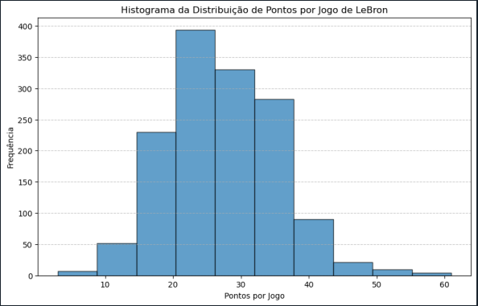

# Análise Estatística do Desempenho de LeBron James (Projeto de Faculdade)

## Descrição do Projeto
Este projeto realiza uma análise estatística do desempenho do jogador de basquete LeBron James com base em um conjunto de dados contendo suas estatísticas de jogos. O script em Python processa um arquivo CSV (lebron_stats.csv), limpa e organiza os dados, calcula estatísticas descritivas e gera visualizações para melhor compreender o desempenho do jogador ao longo dos anos.

## Funcionalidades
- Lê e processa dados de um arquivo CSV.
- Remove colunas irrelevantes.
- Converte e normaliza dados (como datas e minutos jogados).
- Calcula medidas estatísticas descritivas, incluindo:
    - Média
    - Moda
    - Mediana
    - Desvio Padrão
    - Variância
- Gera um histograma para visualizar a distribuição de pontos por jogo.



- Calcula e analisa a assimetria da distribuição de pontos.

## Requisitos
Para executar o projeto, as seguintes bibliotecas Python devem estar instaladas:

- pandas
- numpy
- scipy
- matplotlib
- statistics
- math

**Caso não estejam instaladas, utilize o seguinte comando:**
```bash
pip install pandas numpy scipy matplotlib
```

## Como Executar
1. Certifique-se de que o arquivo lebron_stats.csv esteja no mesmo diretório que o script analise_lebron.py.
2. Execute o script Python:
```bash
python analise_lebron.py
``` 
3. O programa exibirá as estatísticas calculadas no terminal e gerará um histograma para análise visual.

## Resultados Esperados
- Estatísticas básicas dos dados processados.
- Medidas descritivas para a coluna "PTS" (pontos por jogo).
- Histograma da distribuição de pontos por jogo.
- Cálculo do coeficiente de assimetria e determinação do tipo de distribuição de pontos.
